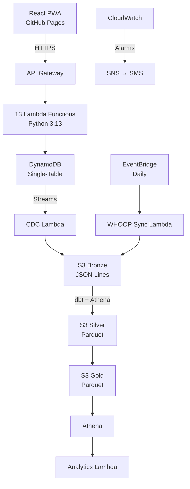
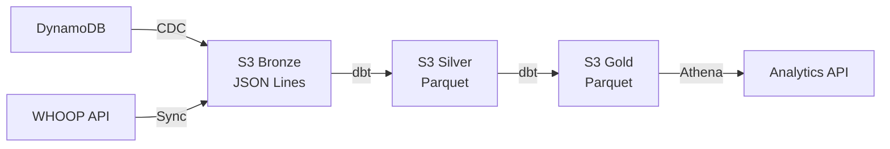
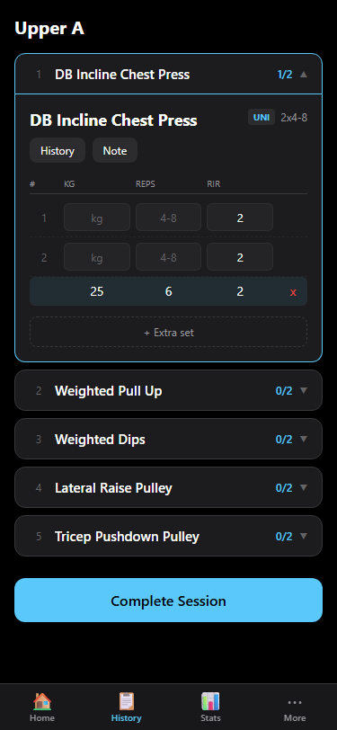

# IronLog — Gym Session Tracker

[](https://github.com/pedro-mesquita7/IronLog/actions/workflows/ci.yml)
[](https://github.com/pedro-mesquita7/IronLog/actions/workflows/deploy.yml)
[](https://opensource.org/licenses/MIT)

A mobile-first PWA for tracking gym sessions, integrating WHOOP recovery data, and visualizing training progression. **Intentionally over-engineered** as a data engineering portfolio project to demonstrate cloud-native architecture, ELT pipelines, medallion data lakes, IaC, and CI/CD — all running for under €0.10/month on AWS.

**Live**: [pedro-mesquita7.github.io/IronLog](https://pedro-mesquita7.github.io/IronLog)

## Architecture

<details open>
<summary>System architecture diagram</summary>



</details>

## Tech Stack

| Layer | Technology | Why |
|---|---|---|
| Frontend | React 18 + TypeScript + Vite (PWA) | Mobile-first, installable, offline queue |
| Hosting | GitHub Pages | Free, auto HTTPS, zero config |
| API | API Gateway (REST) + Lambda (Python 3.13) | Serverless, pay-per-request |
| Auth | Lambda-side JWT (PyJWT) + SSM token | Simplest auth for single-tenant |
| Database | DynamoDB (single-table, PAY_PER_REQUEST) | Zero idle cost, Streams for CDC |
| Data Lake | S3 (Bronze/Silver/Gold medallion) | Pure serverless data lake |
| CDC | DynamoDB Streams → Lambda → S3 | Real-time change capture |
| WHOOP | EventBridge → Lambda → WHOOP API v2 | Daily recovery/sleep sync |
| Transforms | dbt-core + dbt-athena-community | SQL-based ELT, industry standard |
| Analytics | Athena + Recharts | Serverless queries, interactive charts |
| IaC | Terraform (S3 backend) | All infrastructure as code |
| CI/CD | GitHub Actions (3 workflows) | CI on PR, deploy on merge, dbt on schedule |
| Monitoring | CloudWatch Alarms → SNS → SMS | Error alerting for all pipelines |

## Features

- **Session Logging**: Start from training plan, auto-warmup calculations, rest timer, exercise swap
- **Dual PR Detection**: Weight PR + estimated 1RM PR (Epley formula) on every set
- **Plate Calculator**: Greedy largest-first algorithm for barbell exercises
- **WHOOP Integration**: Daily sync of recovery score, HRV, sleep data via OAuth2
- **Analytics Dashboard**: Weight/e1RM progression, volume trends, recovery correlation, PR timeline
- **Data Export**: JSON export via Athena Gold layer queries
- **Offline Support**: Failed writes queued in localStorage, replayed on reconnect
- **Guided Setup**: Seed wizard creates default equipment, exercises, and training plan

## Data Lineage



Bronze: raw CDC events + WHOOP data (append-only). Silver: deduplicated staging. Gold: fact/dim/aggregate tables partitioned by year/month.

Full lineage: [docs/data-lineage.md](docs/data-lineage.md)

### Session Logging



## API Endpoints

| Method | Endpoint | Description |
|---|---|---|
| POST | `/api/auth/login` | Exchange token for JWT |
| GET/POST/PUT/DELETE | `/api/equipment` | Equipment CRUD |
| GET/POST/PUT/DELETE | `/api/exercises` | Exercise CRUD |
| GET/POST/PUT/DELETE | `/api/plans` | Plan CRUD |
| PUT | `/api/plans/{id}/activate` | Activate plan (DDB transaction) |
| POST | `/api/sessions` | Start session (with warmup calc) |
| GET | `/api/sessions` | List sessions (?from=&to=) |
| GET | `/api/sessions/{id}` | Get session with sets + notes |
| PUT | `/api/sessions/{id}/complete` | Complete session (immutable) |
| DELETE | `/api/sessions/{id}` | Soft-delete session |
| POST | `/api/sessions/{id}/sets` | Log set (dual PR detection) |
| GET | `/api/exercises/{id}/history` | Exercise set history |
| POST | `/api/corrections` | Correct a set post-completion |
| GET | `/api/analytics/progression` | Exercise progression (?exercise_id=) |
| GET | `/api/analytics/recovery-correlation` | Recovery vs performance |
| GET | `/api/analytics/prs` | PR timeline |
| GET | `/api/export` | JSON export (?from=&to=) |
| POST | `/api/seed` | Seed default data |

## Setup

### Prerequisites

- Python 3.13+, Node.js 20+, Terraform >= 1.7, AWS CLI v2
- AWS account with profile `ironlog` configured

### Infrastructure

```bash
# Bootstrap (once)
aws s3api create-bucket --bucket ironlog-terraform-state --region eu-west-3 \
  --create-bucket-configuration LocationConstraint=eu-west-3

# Deploy
cd infra
cp terraform.tfvars.example terraform.tfvars  # Edit with your values
terraform init
terraform apply -var-file=terraform.tfvars
```

### Frontend

```bash
cd frontend
npm install
npm run dev          # → localhost:5173
npm run build        # Production build
```

### Backend Tests

```bash
cd backend
pip install -r requirements.txt -r requirements-dev.txt
pytest tests/ -v
```

### dbt

```bash
cd dbt
pip install -r requirements.txt
# Create profiles.yml (see dbt/profiles.yml.example)
dbt run --profiles-dir .
dbt test --profiles-dir .
```

## CI/CD

| Workflow | Trigger | Steps |
|---|---|---|
| **CI** | Pull request | Ruff lint, pytest, ESLint, frontend build, terraform plan |
| **Deploy** | Push to main | Terraform apply, deploy Lambdas, build PWA → gh-pages |
| **dbt** | Daily 06:30 UTC + manual | dbt run, dbt test |

Secrets required: `AWS_ACCESS_KEY_ID`, `AWS_SECRET_ACCESS_KEY`, `ALERT_PHONE`.

## Cost Analysis

| Service | Monthly Cost | Notes |
|---|---|---|
| DynamoDB | €0.00 | PAY_PER_REQUEST, ~100 requests/day |
| Lambda | €0.00 | Free tier: 1M requests + 400K GB-seconds |
| S3 | ~€0.05 | < 1 GB stored |
| Athena | ~€0.01 | ~10 MB scanned/day |
| API Gateway | ~€0.01 | ~3,000 requests/month |
| CloudWatch | €0.00 | Free tier covers 5 alarms |
| SNS | €0.00 | < 100 SMS/month (free tier) |
| **Total** | **~€0.07/month** | Well under €2/month |

## Architecture Decision Records

| # | Decision | Status |
|---|---|---|
| [001](docs/adrs/001-dynamodb-over-postgres.md) | DynamoDB over PostgreSQL | Accepted |
| [002](docs/adrs/002-pure-data-lake.md) | Pure data lake over lakehouse | Accepted |
| [003](docs/adrs/003-ssm-token-auth.md) | SSM token auth | Accepted |
| [004](docs/adrs/004-dbt-athena-over-spark.md) | dbt + Athena over Spark | Accepted |
| [005](docs/adrs/005-python-lambdas.md) | Raw Python Lambda handlers | Accepted |
| [006](docs/adrs/006-github-pages-hosting.md) | GitHub Pages hosting | Accepted |
| [007](docs/adrs/007-intentional-over-engineering.md) | Intentional over-engineering | Accepted |
| [008](docs/adrs/008-jsonl-bronze.md) | JSON Lines for Bronze layer | Accepted |

## License

MIT
