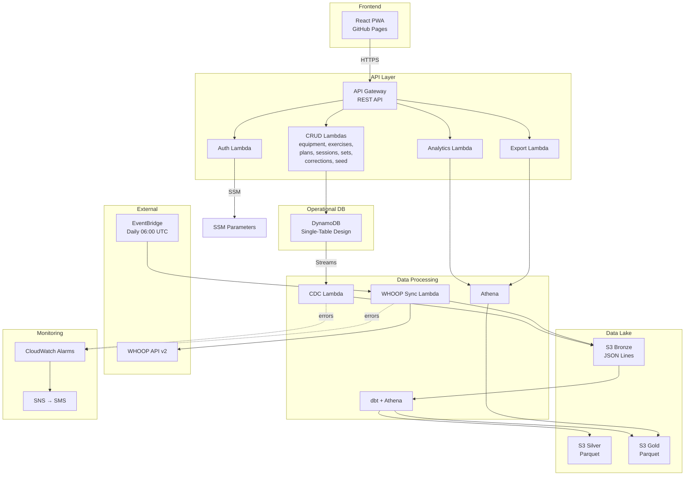

# Architecture

## System Overview

IronLog is a serverless gym session tracker built on AWS, designed as a data engineering portfolio project. It follows a single-tenant model with no user management.

## Security Model

- **Authentication**: SSM-stored random token → JWT (24h expiry)
- **Authorization**: `@require_auth` decorator on all Lambda handlers (except login)
- **JWT validation**: Lambda-side, no API Gateway authorizer
- **Secrets**: SSM Parameter Store SecureString (auth token, JWT secret, WHOOP credentials)
- **CORS**: Restricted to `https://pedro-mesquita7.github.io` and `http://localhost:5173`

## Key Design Decisions

| Decision | Rationale | ADR |
|---|---|---|
| DynamoDB single-table | Zero idle cost, Streams for CDC | [001](adrs/001-dynamodb-over-postgres.md) |
| Pure data lake | No Spark infrastructure needed | [002](adrs/002-pure-data-lake.md) |
| SSM token auth | Simplest auth for single-tenant | [003](adrs/003-ssm-token-auth.md) |
| dbt + Athena | SQL transforms, serverless, portfolio signal | [004](adrs/004-dbt-athena-over-spark.md) |
| Raw Python Lambdas | Minimal cold start, zero framework deps | [005](adrs/005-python-lambdas.md) |
| GitHub Pages | Free, zero config, auto HTTPS | [006](adrs/006-github-pages-hosting.md) |
| Over-engineering | Portfolio demonstrates real-world patterns | [007](adrs/007-intentional-over-engineering.md) |
| JSON Lines Bronze | Avoids pyarrow Lambda layer bloat | [008](adrs/008-jsonl-bronze.md) |

## Infrastructure

All infrastructure is managed by Terraform with state stored in S3. Key resources:

- **13 Lambda functions**: auth, equipment, exercises, plans, sessions, sets, corrections, seed, cdc, whoop_sync, analytics, export
- **DynamoDB**: Single table (`ironlog`) with GSI1, PAY_PER_REQUEST, Streams enabled
- **S3**: Data lake bucket with Bronze/Silver/Gold prefixes
- **API Gateway**: REST API with CORS, 20+ routes
- **Athena**: Workgroup + Glue Catalog database with Bronze/Silver/Gold tables
- **EventBridge**: Daily WHOOP sync schedule
- **CloudWatch**: Error alarms on CDC, WHOOP sync, analytics, export Lambdas
- **SNS**: SMS alerts for alarm notifications
