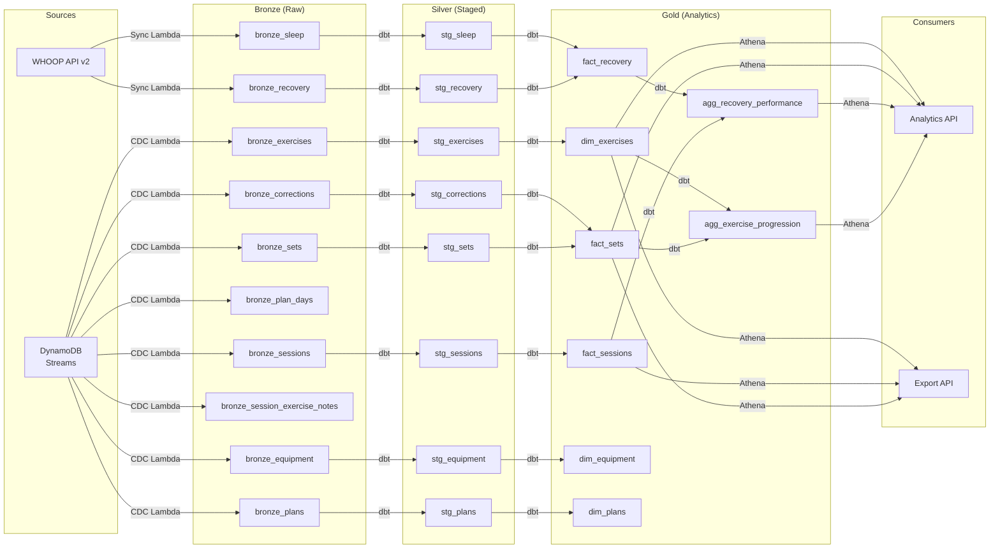

# Data Lineage

## Overview

IronLog uses a **medallion architecture** (Bronze → Silver → Gold) with two data sources: DynamoDB (via CDC) and the WHOOP API.

## Layer Details

### Bronze (Raw Ingestion)

| Source | Target | Format | Trigger |
|---|---|---|---|
| DynamoDB Streams | `bronze/<entity>/year=YYYY/month=MM/day=DD/` | JSON Lines (.jsonl.gz) | CDC Lambda (real-time) |
| WHOOP API v2 | `bronze/recovery/`, `bronze/sleep/` | JSON Lines (.jsonl.gz) | EventBridge (daily 06:00 UTC) |

Each CDC record includes: `_cdc_event_name`, `_cdc_timestamp`, `_cdc_sequence_number`.

### Silver (Staged & Deduplicated)

dbt models with `ROW_NUMBER() OVER (PARTITION BY <id> ORDER BY cdc_timestamp DESC) = 1` deduplication. Materialized as Parquet external tables on S3.

### Gold (Analytics-Ready)

| Model | Description | Partitioning |
|---|---|---|
| `fact_sets` | Sets with corrections applied, total_load computed | year/month |
| `fact_sessions` | Sessions with aggregated metrics (sets, load, PRs, duration) | year/month |
| `fact_recovery` | WHOOP recovery enriched with sleep data | year/month |
| `dim_exercises` | Active exercise definitions | year/month |
| `dim_equipment` | Active equipment inventory | year/month |
| `dim_plans` | Training plan definitions | year/month |
| `agg_exercise_progression` | Weekly exercise metrics (weight, volume, PRs) | year/month |
| `agg_recovery_performance` | Recovery score vs training performance join | year/month |

## Data Quality

Silver layer: `not_null` (PKs, timestamps), `unique` (IDs), `accepted_values` (enums).
Gold layer: `not_null` (PKs), `unique` (facts), `relationships` (fact → dim), custom tests (e1RM > 0, volume >= 0).
